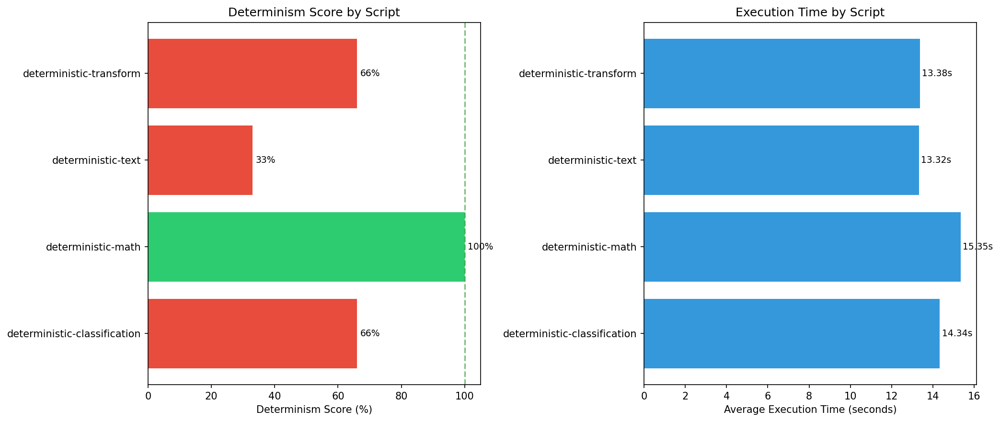

# englang Determinism Benchmark Report

**Generated:** 2025-11-25 16:05:55
**Benchmark Run:** 20251125_160118
**Iterations per script:** 5

## Overall Summary

| Metric | Value |
|--------|-------|
| Scripts Tested | 4 |
| Fully Deterministic | 1 |
| Overall Score | 25.0% |

## Determinism Score by Script

```
deterministic-classification   [#######-----------------------] 25.0%
deterministic-math             [##############################] 100.0%
deterministic-text             [------------------------------] 0.0%
deterministic-transform        [------------------------------] 0.0%
```

## Detailed Results

### deterministic-classification [FAIL]

| Metric | Value |
|--------|-------|
| Status | NON-DETERMINISTIC |
| Determinism Score | 25.0% |
| Iterations | 5 |
| Matching Outputs | 1 |
| Unique Outputs | 2 |
| Avg Execution Time | 14.209s |

### deterministic-math [PASS]

| Metric | Value |
|--------|-------|
| Status | DETERMINISTIC |
| Determinism Score | 100.0% |
| Iterations | 5 |
| Matching Outputs | 4 |
| Unique Outputs | 1 |
| Avg Execution Time | 13.926s |

### deterministic-text [FAIL]

| Metric | Value |
|--------|-------|
| Status | NON-DETERMINISTIC |
| Determinism Score | 0.0% |
| Iterations | 5 |
| Matching Outputs | 0 |
| Unique Outputs | 5 |
| Avg Execution Time | 12.590s |

### deterministic-transform [FAIL]

| Metric | Value |
|--------|-------|
| Status | NON-DETERMINISTIC |
| Determinism Score | 0.0% |
| Iterations | 5 |
| Matching Outputs | 0 |
| Unique Outputs | 2 |
| Avg Execution Time | 14.491s |

## Performance Summary

```
Script                             Avg Time          Status
------------------------------------------------------------
deterministic-classification        14.209s NON-DETERMINISTIC
deterministic-math                  13.926s   DETERMINISTIC
deterministic-text                  12.590s NON-DETERMINISTIC
deterministic-transform             14.491s NON-DETERMINISTIC
```

## Methodology

Each script was executed multiple times with identical inputs.
Outputs were hashed (SHA-256) and compared to measure consistency.

- **Determinism Score**: Percentage of runs matching the first run
- **Unique Outputs**: Number of distinct outputs across all runs
- **DETERMINISTIC**: 100% of runs produced identical output

## Visualization


